# NebuleAir Pro


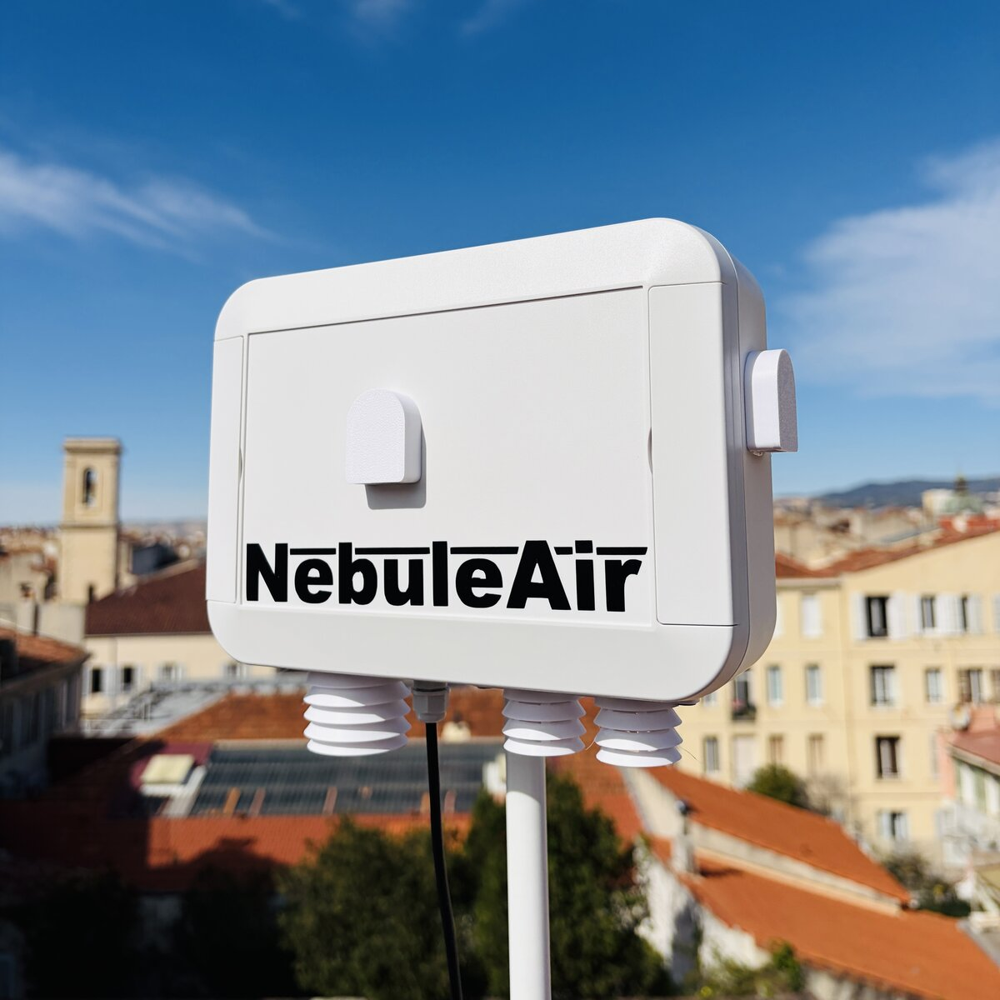{ width="100%" }

## Présentation

Le NebuleAir Pro est la version professionnelle du capteur de qualité de l'air NebuleAir, conçu pour des déploiements en extérieur avec une connectivité cellulaire autonome.

Il est équipé d'un modem 4G **u-blox SARA-R500** qui communique sur les bandes de fréquences **NB-IoT** (Narrowband IoT), permettant une transmission des données sans dépendre d'un réseau WiFi.

## Caractéristiques techniques

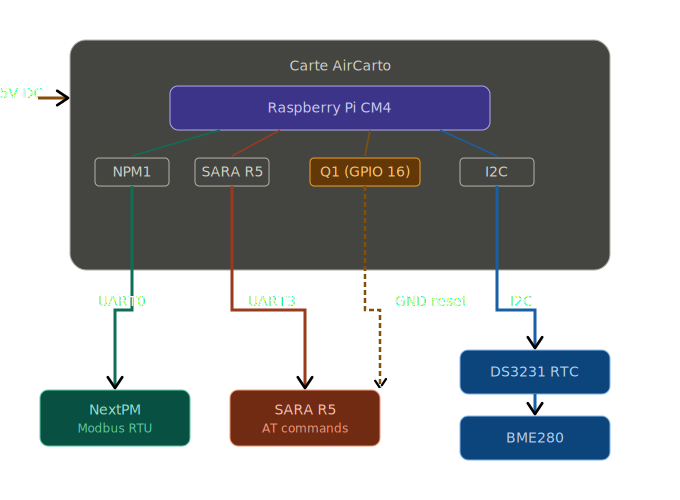{ width="100%" }

### Plateforme

- **Carte mère** : Raspberry Pi Compute Module 4 (CM4)

### Capteurs intégrés de base

| Capteur | Mesure | Paramètres |
|---------|--------|------------|
| **[NextPM](https://tera-sensor.com/nextpm/)** (Tera Sensor) | Particules fines | PM1, PM2.5, PM10 |
| **BME280** (Bosch) | Environnement | Température, humidité, pression atmosphérique |

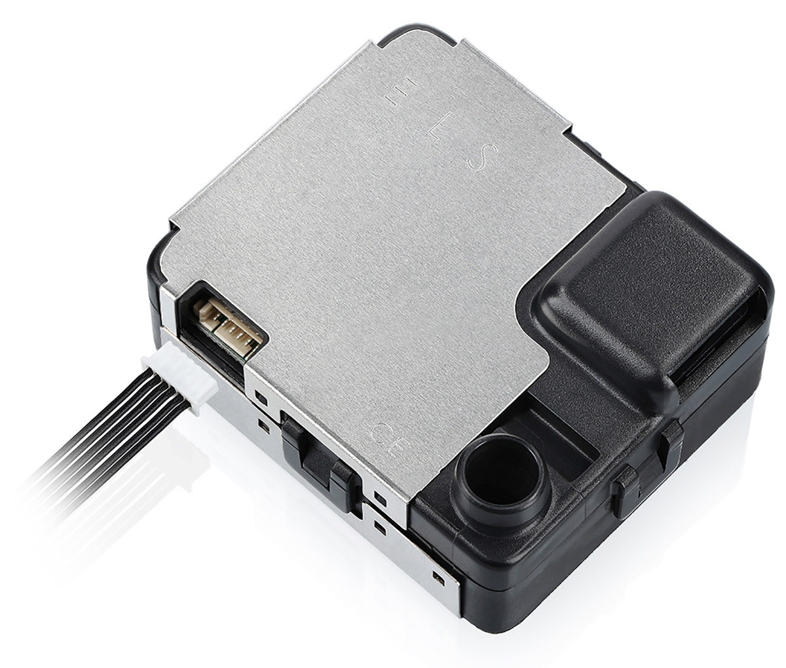{ width="300" }

### Capteurs optionnels

Des capteurs supplémentaires peuvent être ajoutés pour étendre les capacités de mesure :

**Sondes gaz Cairsens®** (fabricant : [Envea](https://www.envea.global/)) :

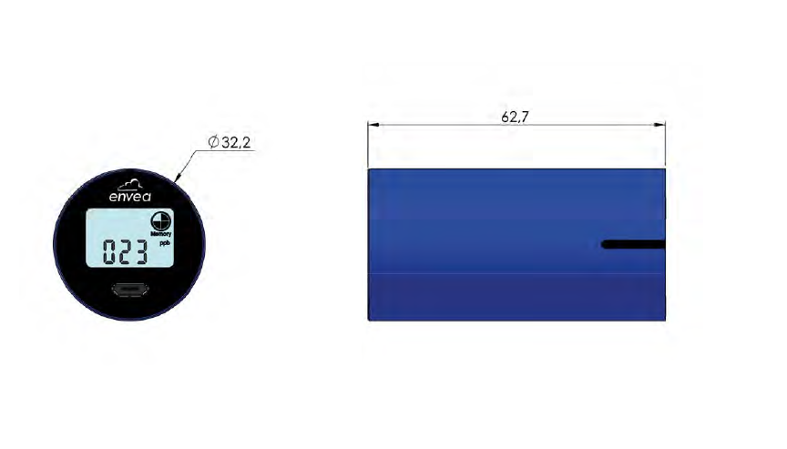{ width="400" }

- NO2 (dioxyde d'azote)
- O3 (ozone)
- Autres gaz selon les modèles Cairsens® disponibles

**Sonomètre** :

- [NSRT mk4](https://convergenceinstruments.com/fr/produit/sonometre-enregistreur-avec-microphone-de-type-1-nsrt_mk4_dev/) (fabricant : Convergence Instruments) - sonomètre enregistreur avec microphone de type 1

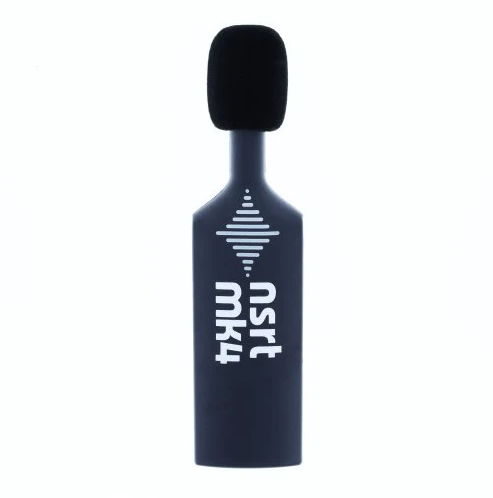{ width="200" }

### Boîtier

- **Boîtier principal** : Takachi WP15-21-6G — **150 x 210 x 55 mm**

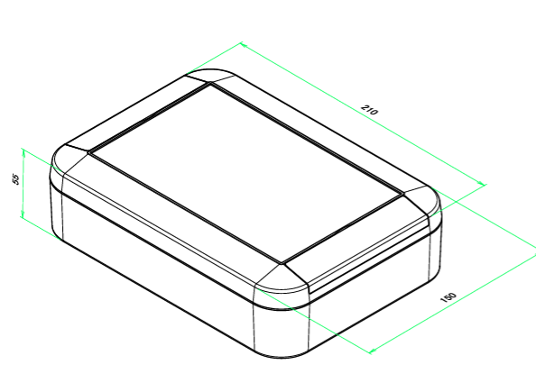{ width="400" }

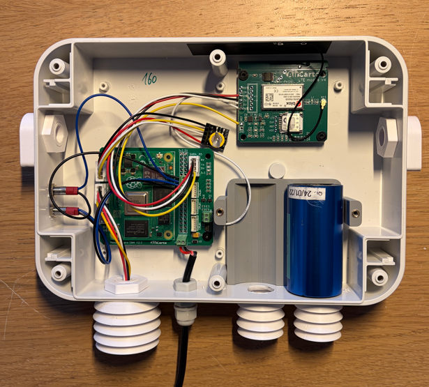{ width="400" }

- **Pièces complémentaires** : éléments imprimés en 3D (PETG) ajoutés sur les côtés et sur le bas de l'appareil
- Boîtier résistant aux intempéries, conçu pour une installation en extérieur

### Connectivité

Le NebuleAir Pro communique sur le réseau **Narrowband IoT** (NB-IoT) à l'aide du module **SARA-R500** de chez **u-blox**. La communication avec le module s'effectue par **requêtes AT**.

Sur le PCB, on retrouve le connecteur pour l'antenne ainsi qu'un slot pour une carte SIM.

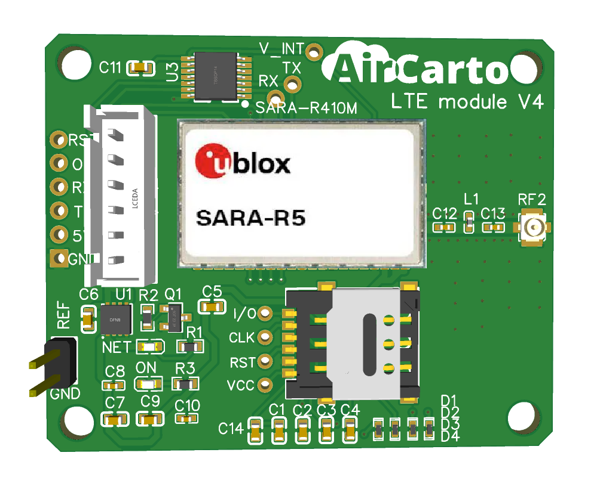{ width="400" }

### Alimentation

Le NebuleAir Pro peut être alimenté de deux manières :

- **Secteur** : alimentation filaire classique
- **Autonome** : pack batterie + panneau solaire

### Consommation électrique

{ width="600" }

En version **PM uniquement** (sans capteurs optionnels), le NebuleAir Pro consomme en moyenne **350 mA sous 5V**, soit environ **1.75 W**.

| Composant | Consommation moyenne |
|-----------|---------------------|
| Raspberry Pi CM4 | ~250 mA |
| NextPM (Tera Sensor) | ~80 mA |
| SARA-R5 (u-blox) | ~40 mA |
| LEDs et divers | le reste |

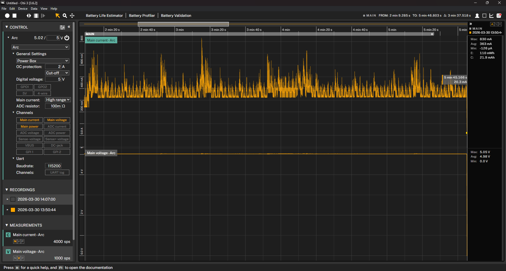{ width="700" }

!!! note "Valeurs indicatives"
    Ces valeurs sont des moyennes observées en fonctionnement normal. La consommation peut varier ponctuellement, notamment lors des phases de transmission du modem.

!!! warning "Pics de consommation"
    La consommation peut atteindre jusqu'à **1 A** lors de certains pics, notamment au démarrage de l'appareil. L'alimentation utilisée doit être dimensionnée en conséquence.

### Horloge interne (RTC)

Le Raspberry Pi n'étant pas équipé d'une horloge interne, un module **RTC** (Real Time Clock) basé sur le **DS3231** est intégré dans le boîtier afin de conserver l'heure même lorsque le capteur est hors tension.

Il existe deux versions du module RTC :

#### Version 1 — pile CR2032 amovible

Cette version utilise une pile bouton CR2032 facilement remplaçable.

{ width="300" }
{ width="300" }

#### Version 2 — pile soudée

Cette version utilise une petite pile directement soudée sur le module. On retrouve **exclusivement** cette version sur les modèles à partir du **nebuleair-pro150**.

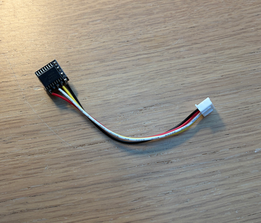{ width="300" }
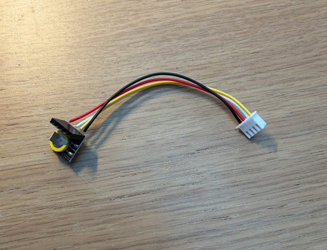{ width="300" }

!!! info "Connecteur identique"
    Les deux versions utilisent le même connecteur. En cas de défaillance de la pile, il est donc facile de remplacer le module par l'une ou l'autre version.

!!! warning "Remise à l'heure"
    Après un changement de module RTC, il est nécessaire de remettre l'horloge à l'heure depuis la page **Admin** de l'interface web de configuration.

### Firmware

Le firmware du NebuleAir Pro est **open source**. Le code source est disponible sur le dépôt Gitea suivant :

[:material-git: Dépôt Gitea — nebuleair_pro_4g](http://gitea.aircarto.fr/PaulVua/nebuleair_pro_4g){ .md-button }

## Installation

L'installation du NebuleAir Pro est simple :

1. **Brancher l'appareil** au câble d'alimentation (adaptateur secteur ou batterie solaire)
2. **L'appareil démarre automatiquement** : les deux LEDs (rouge et verte) clignotent ensemble plusieurs fois
3. **Connexion au réseau mobile** : le modem se connecte automatiquement au réseau NB-IoT disponible
4. **Envoi des données** : les mesures sont transmises toutes les minutes, signalé par le clignotement de la LED verte

!!! info "Carte SIM multi-opérateur"
    La carte SIM intégrée est multi-opérateur. Le choix du réseau est entièrement automatique, aucune configuration n'est nécessaire.

### Indicateurs LED

| LED | Comportement | Signification |
|-----|-------------|---------------|
| Rouge + Verte | Clignotent ensemble | Démarrage de l'appareil |
| Verte | Clignote | Envoi des données en cours |

## Configuration

Aucune configuration n'est nécessaire au démarrage. L'appareil est pré-configuré en usine et se connecte automatiquement au réseau mobile.

### WiFi et mode Hotspot

Le NebuleAir Pro est équipé d'une puce WiFi intégrée. Au démarrage, l'appareil vérifie s'il est connecté à un réseau WiFi connu. Si aucun réseau n'est disponible, il se met automatiquement en **mode Hotspot** (point d'accès) et crée un réseau WiFi local.

#### Se connecter au Hotspot

1. Recherchez le réseau WiFi **`nebuleair-proXXX`** (où `XXX` correspond au numéro de votre capteur) dans la liste des réseaux disponibles sur votre téléphone ou ordinateur
2. Connectez-vous en entrant le mot de passe : **`nebuleaircfg`**
3. Une fois connecté, ouvrez votre navigateur et accédez à la page de configuration à l'adresse :
    - [http://aircarto.local](http://aircarto.local) (via mDNS)
    - ou directement via l'adresse IP : **`192.168.4.1`**

#### Connecter le NebuleAir Pro à un réseau WiFi

Depuis la page de configuration, rendez-vous dans la section **WiFi** pour connecter le capteur à un réseau WiFi local. La liste des réseaux disponibles est affichée (le scan est effectué automatiquement au démarrage, avant l'activation du Hotspot).

Une fois connecté à un réseau WiFi, le Hotspot se désactive et le capteur utilise la connexion WiFi pour transmettre les données en complément de la liaison NB-IoT.

!!! note "Scan WiFi"
    La liste des réseaux WiFi disponibles est scannée au démarrage de l'appareil, avant l'activation du mode Hotspot. Si vous ne voyez pas votre réseau dans la liste, redémarrez le capteur.

## Mise à jour du firmware

Le firmware du NebuleAir Pro peut être mis à jour de deux manières :

### 1. Mise à jour manuelle (hors ligne)

!!! warning "Version minimale requise"
    La mise à jour manuelle hors ligne est disponible à partir de la **version 1.4.6** du firmware.

1. Téléchargez la dernière version du firmware depuis la [page des releases](http://gitea.aircarto.fr/PaulVua/nebuleair_pro_4g/releases)
2. Connectez-vous au capteur via le **mode Hotspot** (voir [WiFi et mode Hotspot](#wifi-et-mode-hotspot))
3. Accédez à la page **Admin** depuis l'interface de configuration
4. Glissez-déposez le fichier du firmware téléchargé sur la zone prévue à cet effet

### 2. Mise à jour en ligne (via WiFi)

1. Connectez le capteur à un réseau WiFi disposant d'un accès internet (voir [Connecter le NebuleAir Pro à un réseau WiFi](#connecter-le-nebuleair-pro-a-un-reseau-wifi))
2. Accédez à la page **Admin** depuis l'interface de configuration
3. Cliquez sur le bouton **Update** pour lancer la mise à jour automatique depuis le dépôt

## Récupération des données

Il existe trois moyens d'accéder aux données de votre capteur NebuleAir Pro.

### 1. Base de données locale

Le NebuleAir Pro enregistre l'ensemble des mesures sur sa mémoire locale dans une base de données SQLite. Il est possible de consulter et télécharger ces données en se connectant directement au capteur.

!!! info "Usage recommandé"
    En fonctionnement normal, les données sont transmises automatiquement via le modem 4G (NB-IoT) et sont accessibles depuis l'[interface MonNebuleAir](#2-interface-web-monnebuleair) ou l'[API AirCarto](#3-api-aircarto). La récupération locale est utile en cas de panne du réseau 4G ou du modem, pour s'assurer qu'aucune donnée n'est perdue.

1. Connectez-vous au capteur via le **mode Hotspot** ou en étant sur le même réseau WiFi (voir [WiFi et mode Hotspot](#wifi-et-mode-hotspot))
2. Accédez à la page **Database** depuis l'interface de configuration à l'adresse `192.168.4.1` (ou `aircarto.local`)

!!! tip "Informations nécessaires"
    Le **nom du capteur** et le **token** sont inscrits sur le bon de livraison fourni avec votre capteur. Conservez-le précieusement.

### 2. Interface web MonNebuleAir

Rendez-vous sur [https://nebuleair.fr/monNebuleAir.html](https://nebuleair.fr/monNebuleAir.html) et renseignez :

- **Nom du capteur** : le nom indiqué sur le bon de livraison
- **Token** : le token associé au capteur

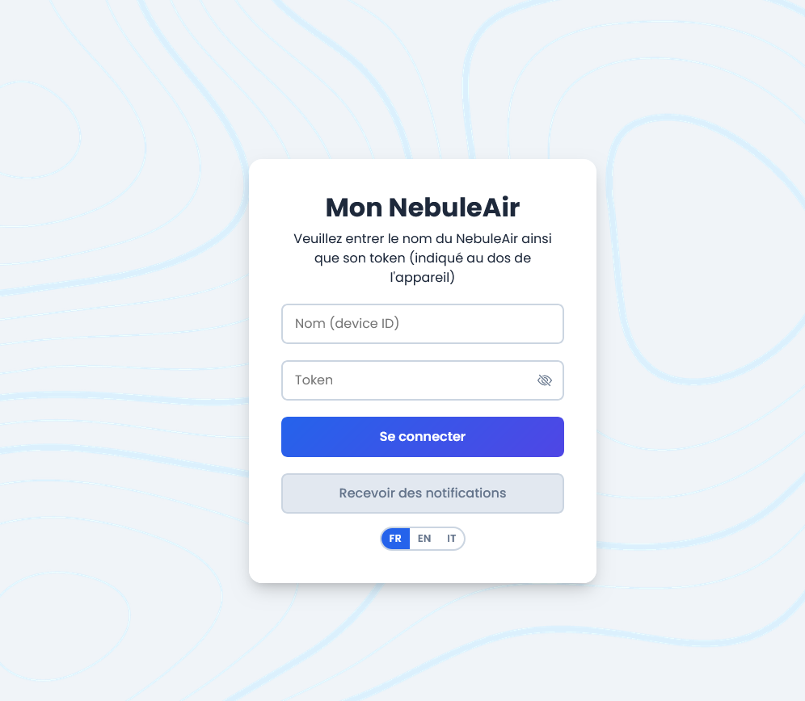

Vous accéderez directement à la visualisation de vos données sous forme de graphiques.

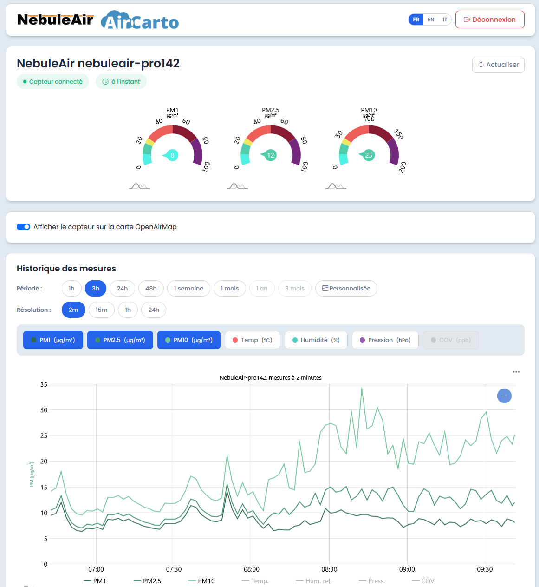

### 3. API AirCarto

Pour une récupération programmatique des données (intégration dans vos propres outils, export, etc.), utilisez l'API AirCarto :

1. Rendez-vous sur la documentation de l'API : [https://api.aircarto.fr/](https://api.aircarto.fr/)
2. Accédez à l'endpoint historique NebuleAir : [https://api.aircarto.fr/#/capteurs/historique_nebuleAir](https://api.aircarto.fr/#/capteurs/historique_nebuleAir)
3. Renseignez les informations de votre capteur (nom et token)

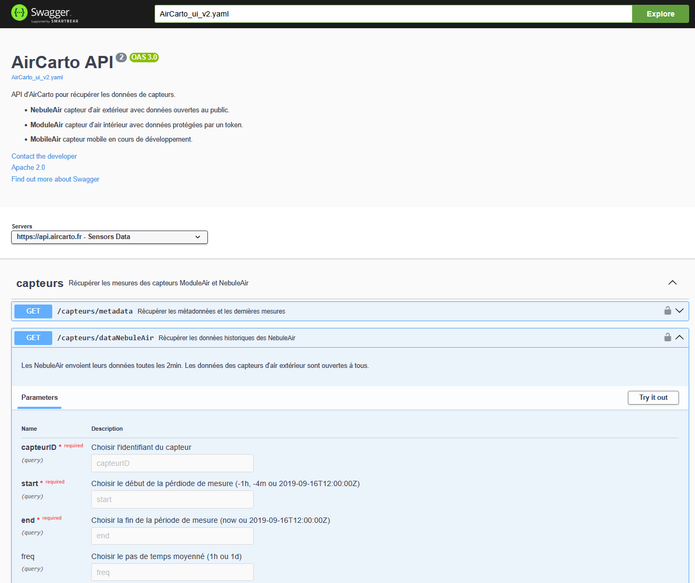

#### Exemple de requête

Pour récupérer les données du capteur `nebuleair-pro142` sur les 2 dernières heures au format JSON :

```
https://api.aircarto.fr/capteurs/dataNebuleAir?capteurID=nebuleair-pro142&start=-2h&end=now&format=JSON
```

!!! warning "Fuseau horaire UTC"
    Les dates envoyées dans la requête et retournées dans la réponse sont en **UTC**. Pensez à convertir si besoin (en France, UTC+1 en hiver, UTC+2 en été).

#### Paramètres de la requête

| Paramètre | Obligatoire | Description | Exemple |
|-----------|:-----------:|-------------|---------|
| `capteurID` | oui | Identifiant du capteur | `nebuleair-pro142` |
| `start` | oui | Date de début de la période. Peut être en **valeur absolue** (date ISO 8601) ou en **relatif** (`-1h` = il y a 1 heure, `-30m` = il y a 30 minutes, `-7d` = il y a 7 jours) | `-2h`, `2026-03-12T06:00:00Z` |
| `end` | oui | Date de fin de la période. Mêmes formats que `start`, avec en plus la valeur `now` pour l'instant présent | `now`, `2026-03-12T08:00:00Z` |
| `format` | non | Format de sortie | `JSON` |
| `freq` | non | Pas de temps pour moyenner les données (intégration). Sans ce paramètre, les données brutes sont retournées (environ 1 mesure/minute) | `1h`, `1d` |

#### Exemple de réponse JSON

```json
[
  {
    "time": "2026-03-12T06:45:41Z",
    "sensorId": "nebuleair-pro142",
    "PM1": 8.3,
    "PM25": 9.2,
    "PM10": 12.4,
    "TEMP": 5.72,
    "HUM": 92.33,
    "PRESS": 987,
    "NOISE": null,
    "COV": null
  },
  {
    "time": "2026-03-12T06:46:42Z",
    "sensorId": "nebuleair-pro142",
    "PM1": 7.7,
    "PM25": 8.5,
    "PM10": 11.5,
    "TEMP": 5.72,
    "HUM": 92.33,
    "PRESS": 987,
    "NOISE": null,
    "COV": null
  },
  {
    "time": "2026-03-12T06:47:43Z",
    "sensorId": "nebuleair-pro142",
    "PM1": 9.5,
    "PM25": 10.6,
    "PM10": 14.3,
    "TEMP": 5.87,
    "HUM": 92.18,
    "PRESS": 987,
    "NOISE": null,
    "COV": null
  },
  {
    "time": "2026-03-12T06:48:43Z",
    "sensorId": "nebuleair-pro142",
    "PM1": 14.3,
    "PM25": 15.8,
    "PM10": 21.4,
    "TEMP": 5.87,
    "HUM": 92.18,
    "PRESS": 987,
    "NOISE": null,
    "COV": null
  }
]
```

| Champ | Description | Unité |
|-------|-------------|-------|
| `time` | Horodatage de la mesure | ISO 8601 (UTC) |
| `sensorId` | Identifiant du capteur | - |
| `PM1` | Particules fines PM1 | µg/m³ |
| `PM25` | Particules fines PM2.5 | µg/m³ |
| `PM10` | Particules fines PM10 | µg/m³ |
| `TEMP` | Température | °C |
| `HUM` | Humidité relative | % |
| `PRESS` | Pression atmosphérique | hPa |
| `NOISE` | Niveau sonore (si disponible) | dB |
| `COV` | Composés organiques volatils (si disponible) | ppb |

## Fichiers 3D

### Boîtier complet

Fichier 3D reprenant l'ensemble du boîtier du NebuleAir Pro avec toutes les pièces assemblées.

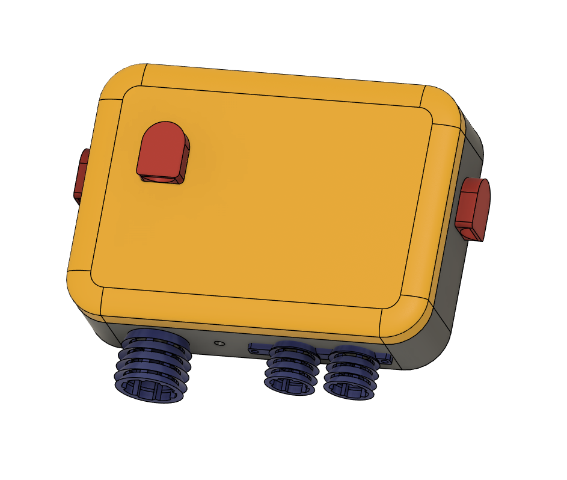{ width="400" }

[:material-download: Télécharger le fichier STEP](../assets/3d_files/NebuleAir Pro.step){ .md-button }

### AirVent

Système de ventilation permettant la circulation de l'air entre l'extérieur et l'intérieur du boîtier. Ces pièces sont fixées sur les côtés de l'appareil.

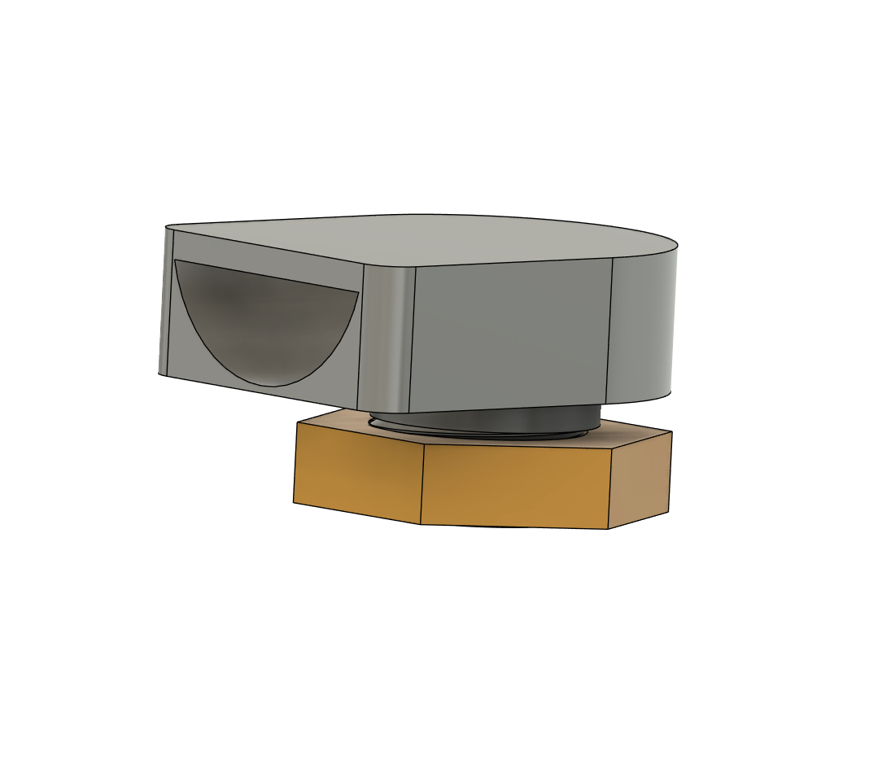{ width="400" }
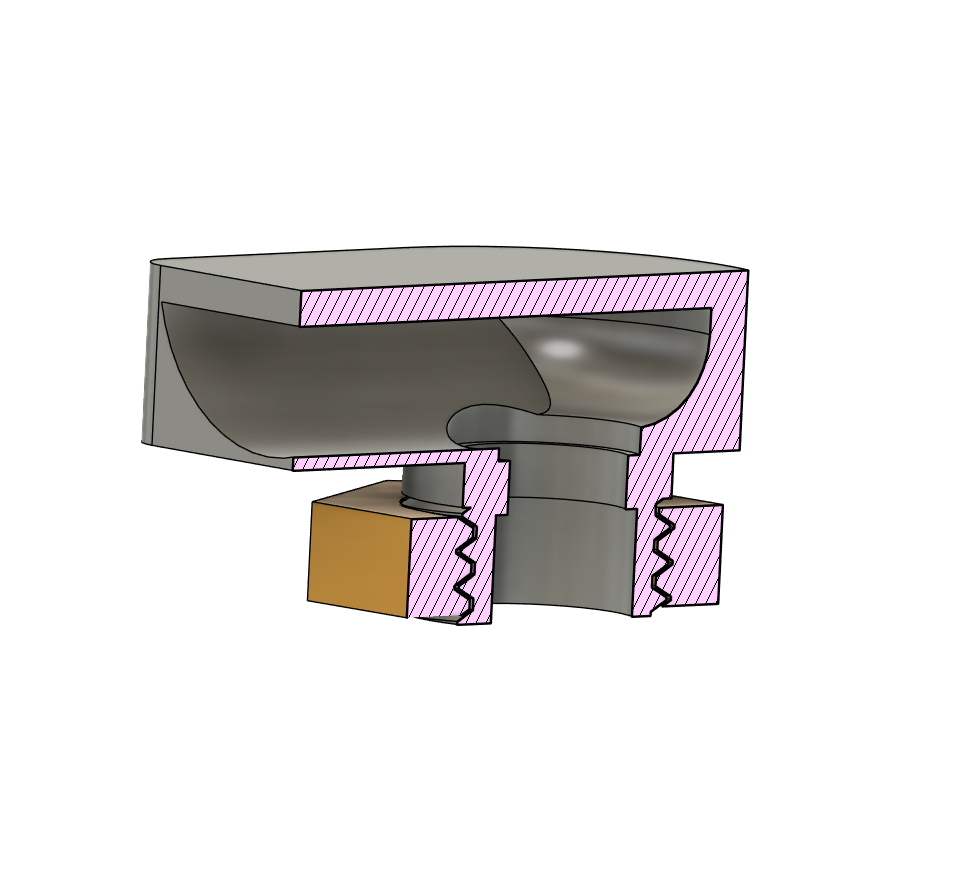{ width="400" }

[:material-download: Télécharger le fichier STEP](../assets/3d_files/AirVent_nebuleair_pro.step){ .md-button }

### Cairsens® AirVent

Pièces positionnées en face des sondes Cairsens® Envea pour permettre la circulation de l'air nécessaire à la mesure des gaz.

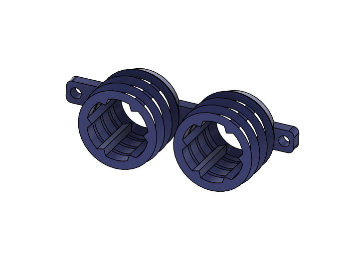{ width="400" }
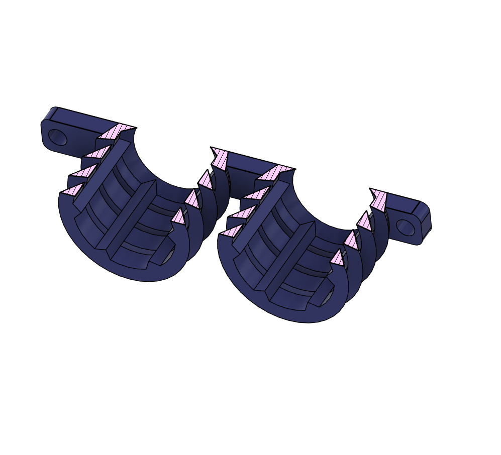{ width="400" }

[:material-download: Télécharger le fichier STEP](../assets/3d_files/AttachesEnvea.step){ .md-button }

### Attaches Cairsens®

Système d'attache interne permettant de maintenir les sondes Cairsens® en place à l'intérieur du boîtier. Il se compose de deux pièces : une partie basse (down) qui accueille les sondes et une partie haute (up) qui vient les bloquer.

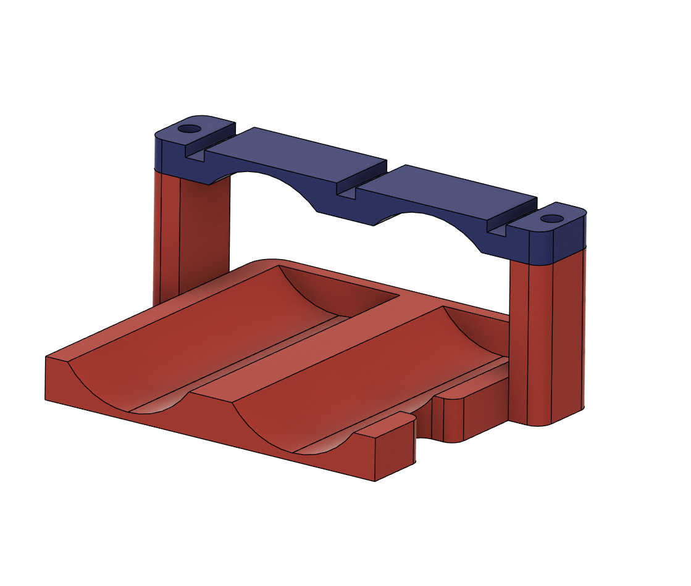{ width="400" }

[:material-download: Télécharger attache_envea_down (STEP)](../assets/3d_files/attache_envea_down.step){ .md-button }
[:material-download: Télécharger attache_envea_up (STEP)](../assets/3d_files/attache_envea_up.step){ .md-button }

### BME AirVent

Système d'aération positionné en face de la sonde de température et d'humidité BME280, permettant une mesure fiable des conditions environnementales.

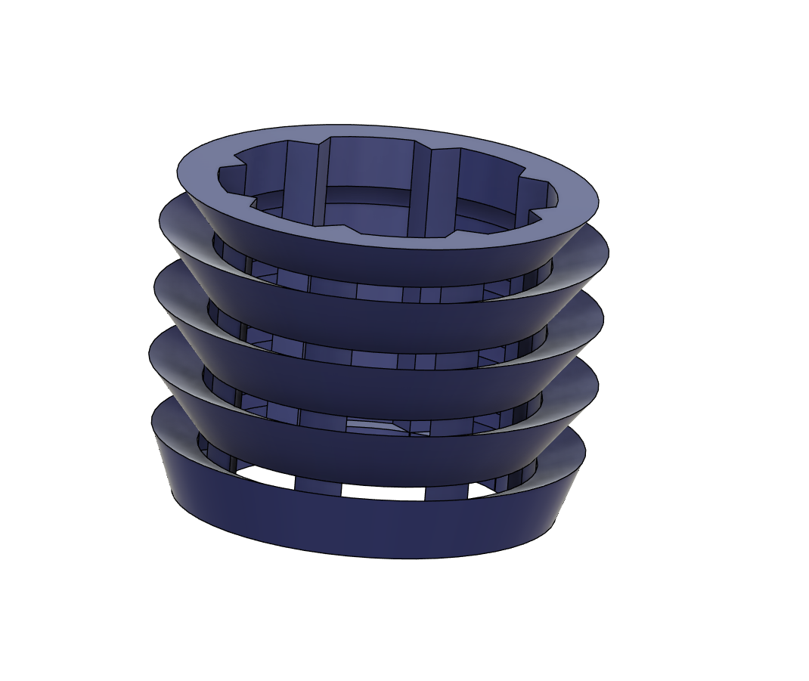{ width="400" }
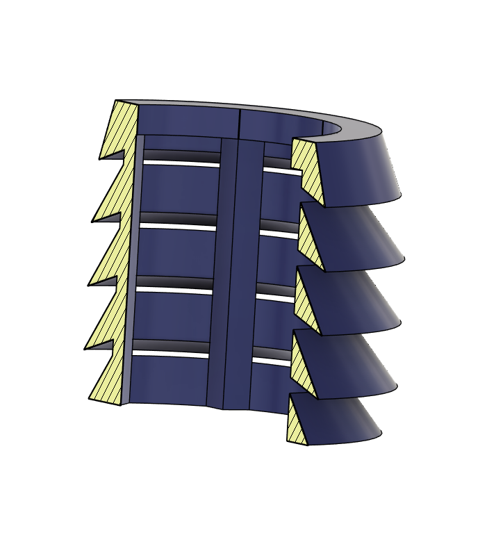{ width="400" }

[:material-download: Télécharger le fichier STEP](../assets/3d_files/BME_airvent.step){ .md-button }

### Attaches PCB

Pièces permettant de fixer les PCB (CM4 et SARA) sur le fond du boîtier. L'attache est collée au fond du boîtier et les PCB se vissent dessus à l'aide de vis M3 (longueur 4 ou 6 mm).

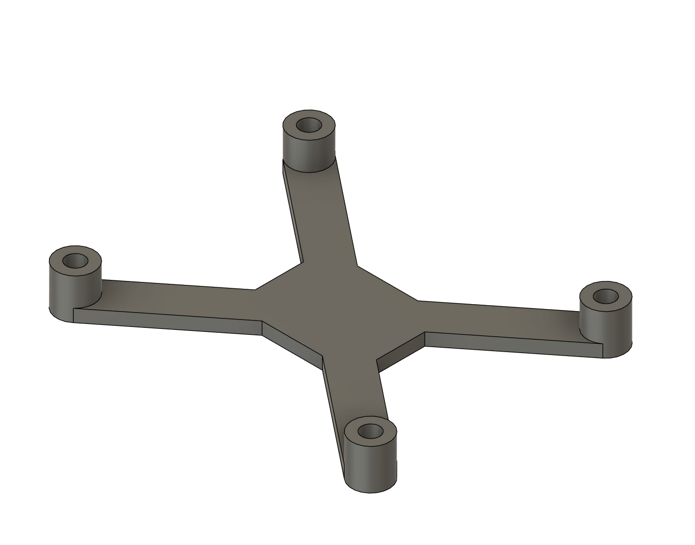{ width="400" }

[:material-download: Télécharger attachesCM4 (STEP)](../assets/3d_files/attachesCM4.step){ .md-button }
[:material-download: Télécharger attachesSARA (STEP)](../assets/3d_files/attachesSARA.step){ .md-button }
