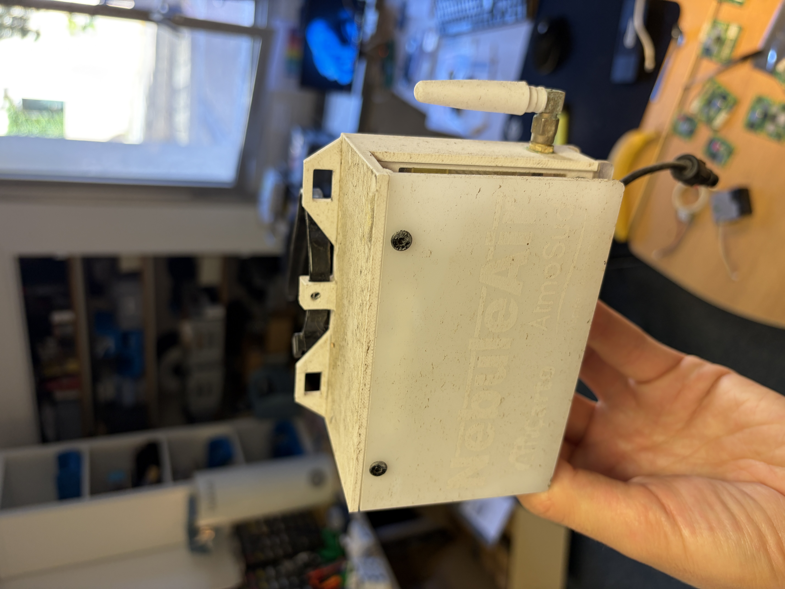
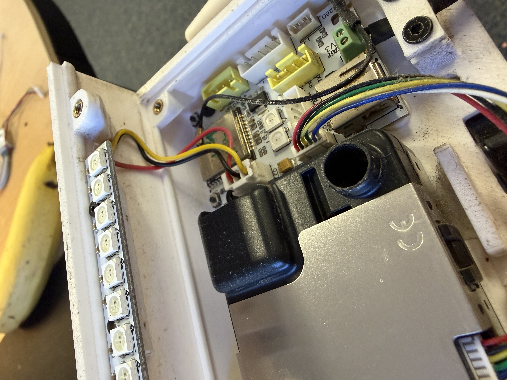
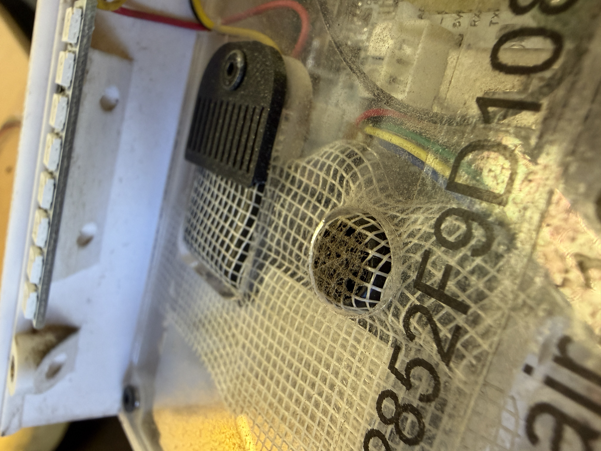
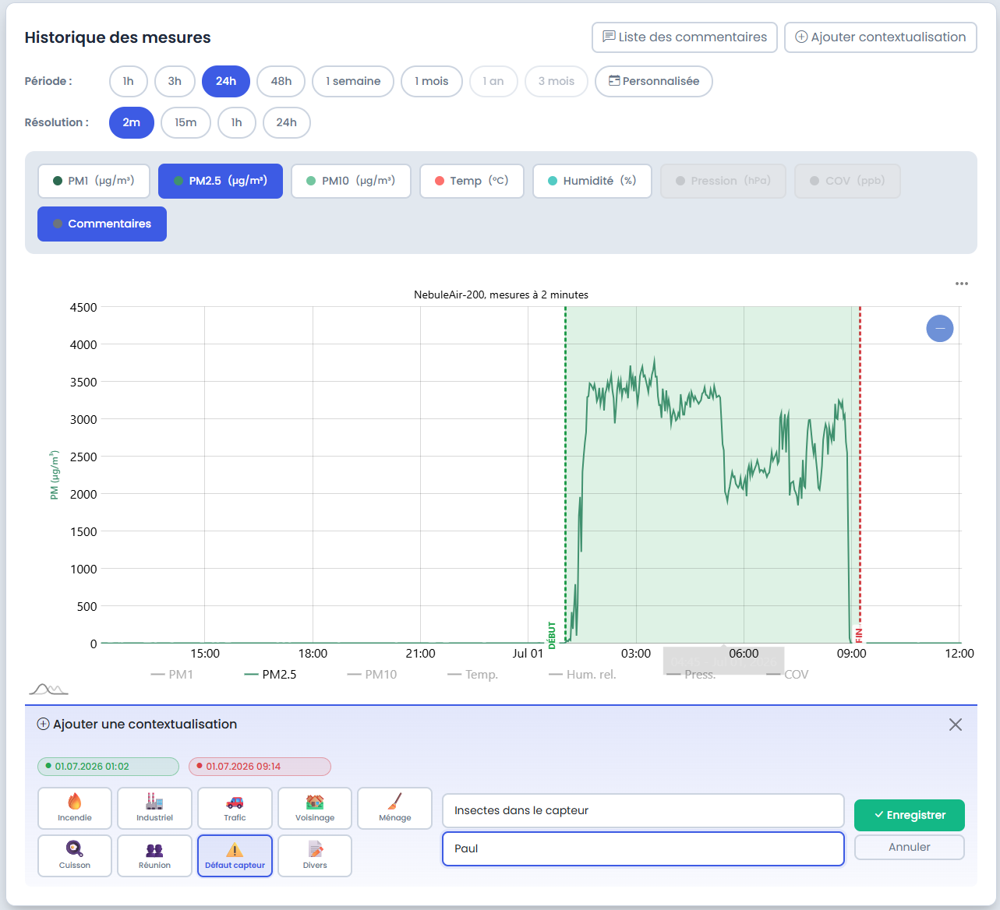

# NebuleAir WiFi

## Présentation

Le NebuleAir WiFi est un capteur de qualité de l'air connecté en WiFi.

## Caractéristiques

- **Microcontrôleur** : ESP32
- **Capteur de particules fines** : NextPM (fabricant : Tera Sensor) - mesure des PM1, PM2.5 et PM10

## Configuration WiFi

Au démarrage, le capteur crée un réseau WiFi temporaire pour permettre sa configuration.

1. **Connectez-vous au réseau WiFi** du capteur :
    - Nom du réseau : `nebuleair-xxxxx`
    - Mot de passe : `nebuleaircfg`

    !!! warning "Réseau temporaire"
        Ce réseau n'est actif que quelques minutes après le démarrage du capteur.

2. **Accédez à la page de configuration** en ouvrant votre navigateur à l'adresse : [http://192.168.4.1/](http://192.168.4.1/)

    

3. **Sélectionnez votre réseau WiFi domestique** et entrez le mot de passe
4. Cliquez sur **Sauvegarder et redémarrer**
5. Le capteur redémarre et se connecte à votre réseau WiFi. Le réseau `nebuleair-xxxxx` disparaît.

### Accès aux données

Une fois connecté, rendez-vous sur [Mon NebuleAir](https://nebuleair.fr/monNebuleAir.html) avec :

- Le **nom du capteur** et le **token** gravés sur le plexiglass de l'appareil

### Géolocalisation

Depuis l'interface Mon NebuleAir, géolocalisez votre capteur via l'onglet dédié :

- Entrez une adresse ou déplacez manuellement le marqueur sur la carte
- Validez la localisation pour que le capteur apparaisse sur [OpenAirMap](https://openairmap.fr)

## Installation

Le NebuleAir WiFi peut être fixé de deux manières à l'aide de colliers de serrage :

### Fixation horizontale

Utilisez deux colliers de serrage sur les attaches latérales (haut droit et haut gauche).

### Fixation verticale

Utilisez deux colliers de serrage sur les attaches centrales.

## Entretien et dépannage

### Mesures PM anormalement élevées

Si le capteur délivre des mesures de particules fines (PM) anormalement élevées — par exemple des pics à plus de 1000 µg/m³, ou des valeurs qui plafonnent très haut — il s'agit très probablement d'un **encrassement trop important de la sonde PM** qui vient altérer la mesure.

!!! warning "Un encrassement fausse la mesure"
    De la poussière, des insectes ou des toiles d'araignée à l'intérieur du capteur perturbent la mesure optique des particules et provoquent des valeurs erronées, sans rapport avec la qualité de l'air réelle.

Pour y remédier, **ouvrez le capteur** et procédez au nettoyage :

1. **Retirez tous les corps étrangers** : insectes, toiles d'araignée et grosses poussières présents à l'intérieur du boîtier et autour de la sonde.

    

2. **Nettoyez la grille en toile** avec les mains ou avec un chiffon. Vous pouvez également la passer sous l'eau, puis la laisser bien sécher avant de la remettre en place.

    
3. **Signalez les mesures erronées sur [Mon NebuleAir](https://nebuleair.fr/monNebuleAir.html)** : indiquez que les mesures concernées proviennent d'un dysfonctionnement du capteur et non d'une mesure effective de la qualité de l'air.

    
